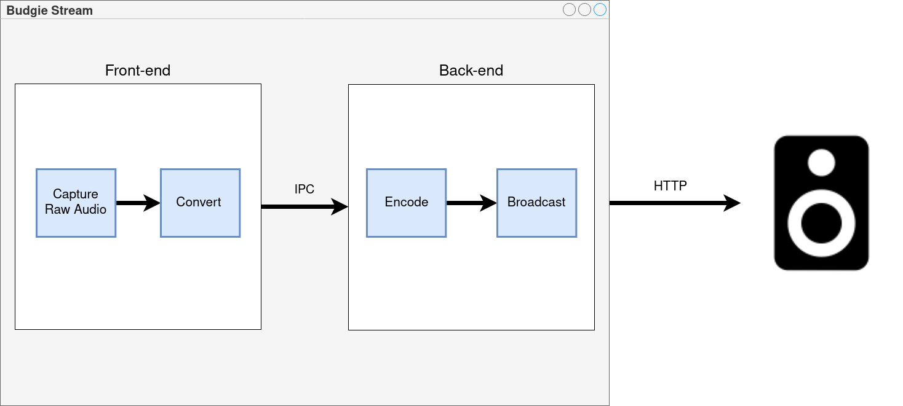
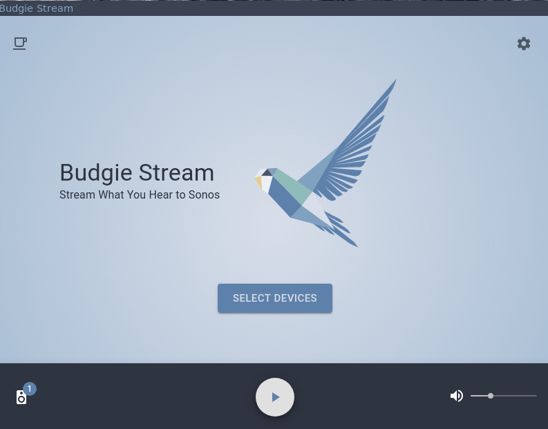

<!--
*** Thanks for checking out this README Template. If you have a suggestion that would
*** make this better, please fork the repo and create a pull request or simply open
*** an issue with the tag "enhancement".
*** Thanks again! Now go create something AMAZING! :D
***
***
***
*** To avoid retyping too much info. Do a search and replace for the following:
*** github_username, repo, twitter_handle, email
-->


<!-- PROJECT LOGO -->
<br />
<p align="center">
  <a href="https://github.com/filahf/budgie-stream">
    
  </a>

  <h3 align="center">Budgie Stream</h3>

  <p align="center">
    Stream system output to your Sonos devices
    <br />
    <a href="https://github.com/filahf/budgie-stream/releases"><strong>Download »</strong></a>
    <br />
    <br />
    <a href="#usage">Usage</a>
    ·
    <a href="https://github.com/filahf/budgie-stream/issues">Report Bug</a>
    ·
    <a href="https://github.com/filahf/budgie-stream/issues">Request Feature</a>
  </p>
  <p align="center">
  
  
  
  </p>
</p>


<!-- TABLE OF CONTENTS -->
## Table of Contents

* [About the Project](#about-the-project)
  * [Technology](#Technology)
  * [Built With](#built-with)
* [Dev Environment](#dev-environment)
  * [Installation](#installation)
  * [Common Errors](#common-errors)
* [Usage](#usage)
* [Contributing](#contributing)
* [License](#license)
* [Support](#support)
* [Contact](#contact)


<!-- ABOUT THE PROJECT -->
## About The Project


### Technology
<p align="center">

</p>
The project is built using Electron/React/Express. The image above shows the simplified flow of audio data, from capture to playback on your Sonos device.

#### Capture
The project utilizes electrons [desktopCapturer](https://www.electronjs.org/docs/api/desktop-capturer) to capture raw audio. The stream of raw audio is in the form of 32 bit float.
#### Conversion
The server expects a stream of 16 bit signed integer. Hence the conversion before sending the stream to the server. 

The stream is sent to the backend by IPC. Early versions of the software sent the stream via socket.io but the use of another package seemed redundant. I noticed no performance changes going from sockets to IPC.

#### Encode
The stream of 16 bit signed integers is encoded to mp3 with LAME. I had issues with the sample rate being inconsistent on different computers leading to a high/low pitched final result. To solve this I implemented an option to change the sample rate in the client.

#### Broadcast
The stream is now in the format of mp3 and ready for broadcast. The stream is linked to an endpoint served by express, the url of the endpoint is then sent by [node-sonos](https://github.com/bencevans/node-sonos) to selected devices.
#### Built With

* Electron
* React
* Express
* Material UI
* [node-sonos](https://github.com/bencevans/node-sonos)
* [nicercast](https://github.com/stephen/nicercast)


<!-- GETTING STARTED -->
## Dev Environment

To get a local copy up and running follow these simple steps.

### Installation
 
1. Clone the repo
```sh
git clone https://github.com/filahf/budgie-stream.git
```
2. Install NPM packages
```sh
yarn install
```
3. Start
```sh
cd budgie-stream/
yarn start
```
#### Common Errors
<details>
  <summary>Node module was built with the wrong version</summary>
  Run electron rebuild

```sh
$(npm bin)/electron-rebuild
```

Or if you're on Windows:

```sh
.\node_modules\.bin\electron-rebuild.cmd
```
</details>


<!-- USAGE EXAMPLES -->
## Usage


<p align="center">

</p>


1. Download system corresponding package
2. Install
3. Make sure to allow Budgie Stream through the firewall
4. Select devices and hit play!


<!-- CONTRIBUTING -->
## Contributing
Any contributions you make are **greatly appreciated**.

1. Fork the Project
2. Create your Feature Branch (`git checkout -b feature/AmazingFeature`)
3. Commit your Changes (`git commit -m 'Add some AmazingFeature'`)
4. Push to the Branch (`git push origin feature/AmazingFeature`)
5. Open a Pull Request


<!-- LICENSE -->
## License

Distributed under the MIT License. See `LICENSE` for more information.

## Support
<a href="https://www.buymeacoffee.com/budgie" target="_blank"></a>

<!-- CONTACT -->
## Contact
Feel free to contact me if you have any questions.

Filip Åhfelt - [filipahfelt.se](https://filipahfelt.se/)

Project Link: [https://github.com/filahf/budgie-stream](https://github.com/filahf/budgie-stream)


[product-screenshot]: images/flowdiagram.png


